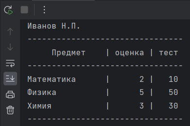

# Погружение в Python. ООП. Финал

Создайте класс студента.
* Используя дескрипторы проверяйте ФИО на первую заглавную букву и наличие только букв.
* Названия предметов должны загружаться из файла CSV при создании экземпляра. Другие предметы в экземпляре недопустимы.
* Для каждого предмета можно хранить оценки (от 2 до 5) и результаты тестов (от 0 до 100).
* Также экземпляр должен сообщать средний балл по тестам для каждого предмета и по оценкам всех предметов вместе взятых.

Классы проекта: 

**Student** - информация о студентах 
**Discipline** - информация о дисциплинах 
**TestRate** - дескриптора проверки оценок 
**TestName** - дескриптор проверки текстовых данных

**Пример выполнения**

Генерация ошибок 

Вывод информации о студенте

Файл сохраненных данных об успеваемости студента

